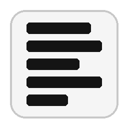

# PDF Redactor

A local, privacy-first tool for redacting personally identifiable information (PII) from PDF files. Runs entirely on your Mac — no data ever leaves your computer.



## Features

- **Selective redaction** — only the detected PII is blacked out; the rest of the text layer stays intact and machine-readable
- **Two detection modes**
  - **Standard** — fast, rule-based NLP via [Presidio](https://github.com/microsoft/presidio) + [spaCy](https://spacy.io)
  - **AI** — context-aware detection via a local [Ollama](https://ollama.com) LLM (catches names that rule-based NLP misses, avoids false positives in tables)
- **German & English** documents supported
- **Metadata cleared** from the output PDF by default
- **Browser UI** via Streamlit — no command line needed after setup
- **macOS Dock app** — one click to launch

---

## Requirements

- macOS 11 (Big Sur) or later, Apple Silicon or Intel
- Python 3.9+ (ships with macOS via Xcode Command Line Tools)
- ~1 GB disk space for NLP models
- [Ollama](https://ollama.com) + `qwen2.5:7b` model (~5 GB) for AI mode (optional)

---

## Quick Start

### 1. Clone the repo

```bash
git clone https://github.com/YOUR_USERNAME/pdf-redactor.git
cd pdf-redactor
```

### 2. Launch (Terminal)

Double-click **`start.command`** in Finder, or run it in Terminal:

```bash
bash start.command
```

The first launch takes a few minutes — it sets up a virtual environment and downloads the NLP models (~1 GB). Subsequent launches are fast.

The app opens at **http://localhost:8501** in your browser.

### 3. (Optional) Install as a macOS app

To get a Dock icon that opens the browser with one click and no Terminal window:

```bash
bash create_app.sh
```

This creates **PDF Redactor.app** in `/Applications` and adds it to your Dock.

---

## Setting Up AI Mode (Ollama)

AI mode uses a local language model for more accurate, context-aware PII detection. Nothing is sent to the cloud.

**1. Install Ollama**

Download from [ollama.com](https://ollama.com) and install the app.

**2. Install the command-line tools**

Click the Ollama icon in the macOS menu bar → **Install command line tools**

**3. Download the model**

```bash
ollama pull qwen2.5:7b
```

This downloads ~5 GB the first time. The model runs locally on your hardware — Apple Silicon GPUs are used automatically via Metal.

**4. Use AI mode in the app**

Select **AI — local LLM, context-aware** in the Detection mode radio button.

> **Tip:** AI mode is slower (~10–30 s per page) but significantly more accurate on documents with uncommon names or complex layouts.

---

## Supported PII Types (Standard Mode)

| Entity | Description |
|--------|-------------|
| `PERSON` | Names of people |
| `EMAIL_ADDRESS` | Email addresses |
| `PHONE_NUMBER` | Phone numbers (all formats) |
| `DATE_TIME` | Dates and times |
| `LOCATION` | Place names |
| `NRP` | Nationalities, religions, political groups |
| `URL` | Web addresses |
| `IP_ADDRESS` | IP addresses |
| `DE_STREET_ADDRESS` | German street addresses (German mode only) |
| `DE_POSTAL_ADDRESS` | German postal codes + city (German mode only) |

---

## How Redaction Works

This tool uses **selective redaction**, not full-page flattening. That distinction matters if you need the output to stay machine-readable:

- **Selective** — PyMuPDF's `page.apply_redactions()` removes text only inside the annotated bounding boxes. The rest of the text layer is untouched. An AI or parser reading the output still gets full document structure, tables, and layout.
- **Full-page flatten** (not used here) — the entire page is rasterised to an image. All text structure is lost; any downstream reader must OCR to recover it.

---

## Project Structure

```
pdf-redactor/
├── redactor.py       # Core engine (Presidio, spaCy, Ollama, PyMuPDF)
├── app.py            # Streamlit browser UI
├── requirements.txt  # Python dependencies
├── start.command     # Terminal launcher (sets up venv + opens browser)
├── create_app.sh     # Builds the macOS .app bundle
└── AppIcon.icns      # App icon
```

---

## Command-Line Usage

```bash
# Activate the virtual environment first
source ~/.venvs/pdf-redactor/bin/activate

# Basic usage (German document)
python redactor.py input.pdf output.pdf

# English document
python redactor.py input.pdf output.pdf --language en

# Adjust confidence threshold (lower = more aggressive)
python redactor.py input.pdf output.pdf --threshold 0.3

# Redact specific entity types only
python redactor.py input.pdf output.pdf --entities PERSON EMAIL_ADDRESS

# Verify text layer integrity after redaction
python redactor.py input.pdf output.pdf --verify

# List all supported entity types
python redactor.py --list-entities
```

---

## Troubleshooting

**"Missing dependency: dlopen … incompatible architecture"**
The virtual environment was built with the wrong Python architecture. Delete it and re-run `start.command`:
```bash
rm -rf ~/.venvs/pdf-redactor
bash start.command
```

**"Ollama not reachable"**
Make sure the Ollama app is running (look for it in the menu bar), then try again.

**"No PII detected" on a scanned document**
Scanned PDFs are image-based and have no text layer. You need to add an OCR layer first (e.g. with [OCRmyPDF](https://github.com/ocrmypdf/OCRmyPDF)) before redacting.

---

## Privacy

- All processing happens locally on your machine
- No internet connection required after initial setup (model downloads)
- Uploaded files are processed in a temporary directory and deleted immediately after download
- PDF metadata (author, title, dates, software) is stripped from the output by default

---

## License

MIT
